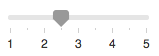





## Introduction

[Custom Elements](../docs/start/platform.html#bundle) present a fantastic opportunity for us to improve accessibility on the web.

To be accessible, elements need to work across multiple devices with varying screen-sizes and different kinds of input. Moreover, your elements should be usable by the broadest group of users, including those with disabilities.

When designing for accessibility, there are four key areas of disability to consider: visual, hearing, mobility and cognition.

**Visual** issues can range from an inability to distinguish colors to no vision at all.

* Ensure a minimum [contrast ratio threshold](http://www.w3.org/TR/WCAG20/#visual-audio-contrast-contrast) is met for text content.

* Avoid communicating information [using solely color](http://www.w3.org/TR/2008/REC-WCAG20-20081211/#visual-audio-contrast-without-color) and ensure that all text is [resizeable](http://www.w3.org/TR/2008/REC-WCAG20-20081211/#visual-audio-contrast-scale).

* Ensure all user interface elements can be used with assistive technologies such as screen readers, magnifiers and braille displays. This entails ensuring that elements are marked up such that accessibility APIs can programmatically determine the *role*, *state*, *value* and *title* of any element.

**Hearing** issues mean a user may have issues hearing sound emitted from a page.

* Make the content understandable using [text alternatives](http://www.w3.org/TR/WCAG20/#media-equiv-av-only-alt) for all content that is not strictly text.

* Ensure you test that your elements are still functional [without sound](http://www.w3.org/TR/2008/REC-WCAG20-20081211/#content-structure-separation-understanding).

**Mobility** issues can include the inability to operate a mouse, a keyboard or touch-screen.

* Make the content of your elements [functionally accessible from a keyboard](http://www.w3.org/TR/wai-aria-practices/#keyboard) for any actions one would otherwise use a mouse for.

* Ensure user interface elements are correctly marked up for assistive technologies; these users may use technologies such as voice control software and physical switch controls, which tend to use the same APIs as other assistive technologies like screen readers.

**Cognitive** issues mean a user may require assistive technologies to help them with reading text, so it’s important to ensure text alternatives exist.

* Avoid a visual presentation that is [repetitive](http://www.w3.org/TR/WCAG20/#time-limits) or flashing as this can cause some users [issues](http://www.w3.org/TR/WCAG20/#seizure).

* Avoid interactions that are timing-based.

This may seem like a lot of bases to cover, but we’ll walk through the process for assessing and then improving the accessibility of your element.

## Is your element accessible?

### Summary (tl;dr) {#tldr}

When auditing your application for accessibility, ask yourself:

* **Can you use your element with the keyboard only?** Does it manage to focus and avoid focus traps? Can it respond to the appropriate keyboard events?

* **Can you use your element with a screen reader?** Have you provided text alternatives for any information which is presented visually? Have you added semantic information using ARIA?

* **Can your element work without sound?** Turn off your speakers and go through your use cases.

* **Can it work without color?** Ensure your element can be used by someone who cannot see colors. A helpful tool for simulating colorblindness is a Chrome extension called [SEE](https://chrome.google.com/webstore/detail/see/dkihcccbkkakkbpikjmpnbamkgbjfdcn),  (try all four forms of color blindness simulation available). You may also be interested in the [Daltonize](https://chrome.google.com/webstore/detail/chrome-daltonize/efeladnkafmoofnbagdbfaieabmejfcf) extension which is similarly useful.

* **Can your element work with high-contrast mode enabled?** All modern operating systems support a high contrast mode.

Native controls (such as `<button>` and `<select>`) have accessibility built-in by the browser. They are focusable using the tab key, respond to keyboard events like enter, space and arrow keys, and have semantic roles, states and properties used by accessibility tools. The default styling should also meet the accessibility requirements listed above.

Custom elements (with the exception of elements that extend native elements like `<button>`) do not have any built-in functionality, including accessibility, so this needs to be provided by you. A good place to start when implementing accessibility is to compare your custom element to an analogous native element (or a combination of several native elements, depending on how complex your component is).

The following is a list of questions you can ask yourself when attempting to make your custom elements more accessible.

### Can your element be used with the keyboard alone?

Ideally, ensure that all functionality in your element can be reached by a keyboard. During your UX design, think about how you would use your element with the keyboard alone, and figure out a consistent set of keyboard interactions.

Firstly, ensure that you have a sensible **focus** target for each element. For example, a complex element like a menu may be one focus target within a page, but should then manage focus within itself so that the active menu item always takes focus.

*Managing focus within a complex element*

#### Using tabindex

The **tabindex** attribute allows elements to be focused using the keyboard. Keyboard-only and assistive technology users both need to be able to place keyboard focus on elements in order to interact with them. Native interactive components are implicitly focusable, so they don’t need a tabindex attribute unless we wish to change their position in the tab order.

There are three types of **tabindex** values:

* `tabindex="0"` is the most common, and will place the element in the "natural" tab order (defined by the DOM order).

* a `tabindex` value greater than 0 will place the element in a *manual* tab order - all elements in the page with a positive `tabindex` value will be visited in numerical order before elements in the natural tab order.

* a `tabindex` value equal to -1 will cause the element to be *programmatically* focusable, but not in the tab order.

For custom elements, always use **`tabindex` values of `0` or `-1`,** as you won’t be able to determine the order of elements on a given page ahead of time—and even if we did, they may be subject to change. A `tabindex` value of `-1` is particularly useful for managing focus within complex elements as described above.

Also ensure that focus is **always visible**, whether by allowing the default focus ring style, or applying a discernible focus style. Remember not to trap the keyboard user—focus should be able to be moved away from an element using only the keyboard.

#### Using autofocus

The HTML **autofocus** attribute allows an author to specify that a particular element should automatically take focus when the page is loaded. It is already supported on [all web form controls](http://www.whatwg.org/specs/web-apps/current-work/multipage/association-of-controls-and-forms.html#autofocusing-a-form-control), including `<input>`. To autofocus elements in your own custom element, call the [focus()](https://developer.mozilla.org/en-US/docs/Web/API/HTMLElement.focus) method supported on all HTML elements that can be focused (e.g `document.getElementById('myButton').focus()`).

#### Adding keyboard interaction

Once your element is focusable, try to provide a good **keyboard interaction** story when an element is focused, by handling appropriate keyboard events - for example, allow the user to use arrow keys to select menu options, and space or enter to activate buttons. The ARIA [design patterns guide](http://www.w3.org/TR/wai-aria-practices/#aria_ex) provides some guidance here.

Finally, ensure that your keyboard shortcuts are **discoverable**. For example, a common practice is to have a keyboard shortcut legend (on-screen text) to inform the user that shortcuts exist. For example, "Press ? for keyboard shortcuts". Alternatively a hint such a tooltip could be used to inform the user about the shortcut existing.

### Can you use your element with a screen reader?

Around 1-2% of users will be using a screen reader. At the end of this article, we list some screen readers which are free to use: try using your element with at least one of these screen readers. Can you determine all important information and interact with the element using the screen reader and keyboard alone?

The following questions should help guide you in addressing screen reader accessibility:

#### Do all elements and images have meaningful text alternatives?

Wherever information about the *name* or *purpose* of an interactive element is conveyed visually, an accessible text alternative needs to be provided.

For example, if your `<x-menu>` element only displays an icon such as  to indicate that it is a settings menu, it needs an accessible text alternative such as "settings", which conveys the same information. Depending on context, this may use an `alt` attribute, an `aria-label` attribute, an `aria-labelledby` attribute, or plain text in the Shadow DOM. You can find general technical tips in [WebAIM Quick Reference](http://webaim.org/resources/quickref/).

Any element which displays an image should provide a mechanism for providing alternative text for that image, analogous to the alt attribute.

#### Do your custom elements provide semantic information?

Assistive technology conveys semantic information which is otherwise expressed to sighted users via visual cues such as formatting, cursor style, or position. Native elements have this semantic information built-in by the browser, but for custom elements you need to use [ARIA](http://www.w3.org/WAI/PF/aria/) to add this information in.

One technology which is critical for custom element accessibility is [WAI-ARIA](http://www.w3.org/WAI/PF/aria/). ARIA is a specification defining support for accessible web apps. It defines markup extensions (implemented as attributes on elements), which can be used to provide additional information about the semantics of elements to assistive technologies like screen readers.

As a rule of thumb, any element which listens to a mouse click or hover event should not only have some kind of keyboard event listener, but also an ARIA role and potentially ARIA states and attributes.

For example, a custom `<x-slider>` element might take an ARIA role of slider, which has some related ARIA attributes: `aria-valuenow`, `aria-valuemin` and `aria-valuemax`. By binding these attributes to the relevant properties on your custom element, you can allow users of assistive technology to interact with the element and change its value, and even cause the visual presentation of the element to change accordingly.

    <!-- x-slider element template adds ARIA role and attributes which are visible in light DOM -->
    <x-slider role="slider" aria-valuemin="1" aria-valuemax="5" aria-valuenow="2.5">
    </x-slider>

### Can users understand everything without relying on color?

Color shouldn’t be used as the only means of conveying information, such as indicating a status, prompting for a response or distinguishing a visual custom element. For example, if you created an `<x-map>` element using color to distinguish between heavy, moderate and light traffic, an alternative means of distinguishing traffic levels should also  be made available: one solution might be to hover over an element to display information in a tooltip.

### Is there sufficient contrast between the text/images and the background?

Any text content displayed in your element should meet the [minimum (AA) contrast bar](http://www.w3.org/TR/2008/REC-WCAG20-20081211/#visual-audio-contrast-contrast). Consider providing a high-contrast theme which meets the [higher (AAA) bar](http://www.w3.org/TR/2008/REC-WCAG20-20081211/#visual-audio-contrast7), and also ensure that user agent style sheets can be applied if users require extreme contrast or different colors. You can use this [Color Contrast Checker](http://webaim.org/resources/contrastchecker/) as an aid when doing design.

### Is the moving or flashing content in your elements stoppable and safe?

Content that moves, scrolls or blinks that lasts for anything more than 5 seconds should be able to be paused, stopped or hidden. In general, try to flash no more than three times per second.

## Accessibility Tooling

A number of tools are available that can assist with debugging the accessibility of your elements. These include:

* The [Accessibility DevTools extension](https://chrome.google.com/webstore/detail/accessibility-developer-t/fpkknkljclfencbdbgkenhalefipecmb?utm_source=chrome-ntp-icon) for Chrome provides a helpful audit for discovering accessibility issues, including issues within Shadow DOM.

* You can examine the way that assistive technologies see web content by using [Accessibility Inspector](https://developer.apple.com/library/mac/documentation/Accessibility/Conceptual/AccessibilityMacOSX/OSXAXTesting/OSXAXTestingApps.html#//apple_ref/doc/uid/TP40001078-CH210-TPXREF101) (Mac), or [Windows Automation API Testing Tools](http://msdn.microsoft.com/en-us/library/windows/desktop/dd373661(v=vs.85).aspx) and [AccProbe](http://accessibility.linuxfoundation.org/a11yweb/util/accprobe/) (Windows). Additionally you can see the full accessibility tree that Chrome creates by navigating to *chrome://accessibility*.

* The best way to test for screen reader support on a Mac is using the VoiceOver utility. You can use ⌘F5 to enable/disable, Ctrl+Option ←→ to move through the page and Ctrl+Shift+Option + ↑↓ to move up/down tree. For more detailed instructions, see the [full list of VoiceOver commands](http://www.apple.com/voiceover/info/guide/_1131.html) and the [list of VoiceOver Web commands](http://www.apple.com/voiceover/info/guide/_1131.html#vo27972).

* On Windows, [NVDA](http://www.nvaccess.org/) is a free, open source screen reader which is fully featured and rapidly gaining in popularity. However, note that it has a much steeper learning curve for sighted users than VoiceOver.

* On Chrome, [ChromeVox](http://www.chromevox.com/) is a screen reader which is available as a Chrome extension, and built in on ChromeOS devices. However, it currently doesn’t read content in Shadow DOM.

