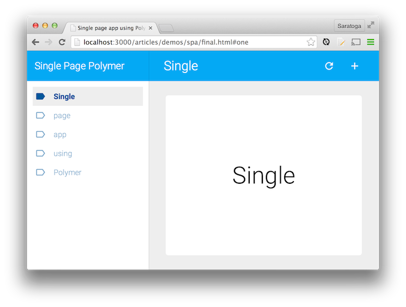







So how do you build a single page application (SPA) with Polymer? On the Polymer team we get this question a lot. Our answer (as always) is..."use components!" However, it's never immediately obvious how to tackle an existing problem with new technologies. How do you compose a bunch of modular components into a larger, functional app?

  

In this article, I'll show you how to build a full-featured single page application that:

- Is built entirely using Polymer's [core elements](../docs/elements/core-elements.html)
- Practices responsive design
- Transitions between views using data-binding features
- Features URL routing and deep linking
- Is keyboard accessible
- Loads content dynamically on-demand (optional)

<a href="demos/spa/final.html" target="_blank">
  <paper-button raised class="blue">
    <core-icon icon="arrow-forward"></core-icon>Launch the demo
  </paper-button>
</a>

If you like to eat dessert first, you can find the files for the
finished demo here:

-   <a href="https://github.com/Polymer/docs/blob/master/0.5/articles/demos/spa/final.html" target="_blank">
    HTML (<code>final.html</code>)</a>
-   <a href="https://github.com/Polymer/docs/blob/master/0.5/articles/demos/spa/elements.html" target="_blank">
    Imports (<code>elements.html</code>)</a>
-   <a href="https://github.com/Polymer/docs/blob/master/0.5/articles/demos/spa/app.js" target="_blank">
    JavaScript (<code>app.js</code>)</a>
-   <a href="https://github.com/Polymer/docs/blob/master/0.5/articles/demos/spa/styles.css" target="_blank">
    CSS (<code>styles.css</code>)</a>

## App structure
{:style="clear:both"}

Designing a layout is one of the first tasks when starting a project. As part of its [core element collection](../docs/elements/core-elements.html), Polymer
has several [layout elements](../docs/elements/layout-elements.html) (`<core-header-panel>`, `<core-drawer-panel>`, `<core-toolbar>`) for scaffolding an application's structure. These components are useful by themselves, but for an even quicker start, we're going to focus on `<core-scaffold>`. It starts you off with a responsive mobile layout by assembling several of the foundational elements.

`<core-scaffold>`'s children are arranged by specifying attributes and/or using specific tags. For example, using a `<nav>` element creates the app drawer. Alternatively, you can use the `navigation` attribute on any element (e.g `<core-header-panel navigation>`). The toolbar is designated with the `tool` attribute. All other children end up in the main content area.

<pre>
&lt;body unresolved fullbleed&gt;
  &lt;core-scaffold id="scaffold"&gt;
    &lt;<b>nav</b>&gt;Left drawer&lt;/<b>nav</b>&gt;
    &lt;core-toolbar <b>tool</b>&gt;Application&lt;/core-toolbar&gt;
    &lt;div&gt;Main content&lt;/div&gt;
  &lt;/core-scaffold&gt;
&lt;/body&gt;
</pre>

Let's dive deeper on each of these sections.

### Drawer

Markup that you put in the navigation element ends up in a slide-away app drawer.
For our purposes, we'll stick with a heading (`<core-toolbar>`) and navigational links (`<core-menu>`):

    <nav>
      <core-toolbar>Single Page Polymer</core-toolbar>
      <core-menu selected="0">
        <paper-item noink>
          <core-icon icon="label-outline"></core-icon>
          <a href="#one">Single</a>
        </paper-item>
        <paper-item noink>
          <core-icon icon="label-outline"></core-icon>
          <a href="#two">page</a>
        </paper-item>
        ...
      </core-menu>
    </nav>

**Note** Right now, `<core-menu selected="0">` is hard-coded to select the first item. We'll [make that dynamic](#databinding) later.
{: .alert .alert-info }

### Toolbar

A toolbar spans the top of the page and contains functional icon buttons. A perfect
element for that type of behavior is `<core-toolbar>`:

    <!-- flex makes the bar span across the top of the main content area -->
    <core-toolbar tool flex>
      <!-- flex spaces this element and justifies the icons to the right-side -->
      
Application

      <core-icon-button icon="refresh"></core-icon-button>
      <core-icon-button icon="add"></core-icon-button>
    </core-toolbar>

### Main content {#maincontent}

The last section is left for your content! It can be any type of element. A `
` is perfectly fine:

    

      <!-- fill with pages -->
    

The `fit` attribute instructs the main area to take up the full width and height of its parent and `layout horizontal center-center` centers that content horizontally and vertically using flexbox.

## Creating "views"

Multiple views (or pages) can be created with `<core-pages>` or `<core-animated-pages>`. Both elements are useful for displaying only one child at a time. The benefit of `<core-animated-pages>` is that it provides more defaults and slick transitions between pages.

The demo uses `<core-animated-pages>` with the `slide-from-right` transition. The first thing to do is import the element definition _and_ the `slide-from-right` transition:

    <link rel="import" href="components/core-animated-pages/core-animated-pages.html">
    <link rel="import" href="components/core-animated-pages/transitions/slide-from-right.html">

then drop in your content:

<pre>
&lt;div layout horizontal center-center fit&gt;
  <b>&lt;core-animated-pages  selected=&quot;0&quot; transitions=&quot;slide-from-right&quot;&gt;</b>
    &lt;section layout vertical center-center&gt;
      &lt;div&gt;Single&lt;/div&gt;
    &lt;/section&gt;
    &lt;section layout vertical center-center&gt;
      &lt;div&gt;page&lt;/div&gt;
    &lt;/section&gt;
    ...
  <b>&lt;/core-animated-pages&gt;</b>
&lt;/div&gt;
</pre>

**Note** Right now, `<core-animated-pages selected="0">` is hard-coded to select the first page. We'll [make that dynamic](#databinding) later.
{: .alert .alert-info }

By now you should have <a href="demos/spa/example1.html" target="_blank">a basic app</a>, but there's **something subtle to notice**. Thanks to Polymer's [layout attributes](../docs/polymer/layout-attrs.html) and the [default styles](/articles/styling-elements.html#default-styles) provided by each element, you've **achieved a responsive app without writing a lick of CSS**! Of course, with a little inspiration from the [material design color palette](http://www.google.com/design/spec/style/color.html), [less than 10 CSS rules](demos/spa/styles.css) turns the app into something beautiful.

<a href="demos/spa/example1.html" target="_blank">
  <paper-button raised class="blue">
    <core-icon icon="arrow-forward"></core-icon>Demo: without CSS
  </paper-button>
</a>
<a href="demos/spa/example1-style.html" target="_blank">
  <paper-button raised class="blue">
    <core-icon icon="arrow-forward"></core-icon>Demo: with CSS
  </paper-button>
</a>

<a href="https://github.com/Polymer/docs/blob/master/0.5/articles/demos/spa/example1-style.html" target="_blank">
  <paper-button raised class="blue">
    <core-icon icon="arrow-forward"></core-icon>See the HTML
  </paper-button>
</a>

<a href="https://github.com/Polymer/docs/blob/master/0.5/articles/demos/spa/styles.css" target="_blank">
  <paper-button raised class="blue">
    <core-icon icon="arrow-forward"></core-icon>See the CSS
  </paper-button>
</a>

### Using data binding {#databinding}

We have an app, but it's nothing to write home about. It's far from DRY. Similar markup is repeated all over the place:

    <nav>
      <core-menu selected="0">
        <paper-item noink>
          <core-icon icon="label-outline"></core-icon>
          <a href="#one">Single</a>
        </paper-item>
        <paper-item noink>
          <core-icon icon="label-outline"></core-icon>
          <a href="#two">page</a>
        </paper-item>
        <paper-item noink>
          <core-icon icon="label-outline"></core-icon>
          <a href="#three">app</a>
        </paper-item>
        ...
      </core-menu>
    </nav>

It's also not dynamic. When a user selects a menu item the view doesn't update. Luckily, both of these problems are easily solved with Polymer's [data-binding features](../docs/polymer/databinding.html).

#### Auto-binding template {#autobinding}

To leverage data binding outside of a `<polymer-element>`, Wrap Yo App&#0153; inside an auto-binding `<template>` elements:

<pre>
&lt;body unresolved fullbleed>
  <b>&lt;template is="auto-binding"></b>
    &lt;core-scaffold id="scaffold">
      ...
    &lt;/core-scaffold>
  <b>&lt;/template></b>
&lt;/body>
</pre>

**Tip** An auto-binding `<template>` allows us to use `{{}}` bindings, [expressions](../docs/polymer/expressions.html), and [`on-*` declarative event handlers](../docs/polymer/polymer.html#declarative-event-mapping) inside the main page.
{: .alert .alert-info}

#### Simplifying the markup using a data model {#datamodel}

You can greatly **reduce the amount of markup you write by generating it from a data model**. In our case, all the menu items and pages can be rendered with a pair of `<template repeat>`:


    <core-menu valueattr="hash" selected="{{route}}">
      <template repeat="{{page in pages}}">
        <paper-item hash="{{page.hash}}" noink>
          <core-icon icon="label-outline"></core-icon>
          <a href="#{{page.hash}}">{{page.name}}</a>
        </paper-item>
      </template>
    </core-menu>

    <core-animated-pages valueattr="hash" selected="{{route}}"
                         transitions="slide-from-right">
      <template repeat="{{page in pages}}">
        <section hash="{{page.hash}}" layout vertical center-center>
          
{{page.name}}

        </section>
      </template>
    </core-animated-pages>


Which is driven by this data model:

    

Notice that `<core-animated-pages>` and `<core-menu>` are **linked by binding
their `selected` attributes** together. Now, when a user clicks on a nav item the view updates accordingly. The `valueattr="hash"` tells both elements to use the `hash` attribute on each item as the selected value.


    <!-- data-bind the menu selection with the page selection -->
    <core-menu valueattr="hash" selected="{{route}}">
    ...
    <core-animated-pages valueattr="hash" selected="{{route}}">


<a href="demos/spa/example2.html" target="_blank">
  <paper-button raised class="blue">
    <core-icon icon="arrow-forward"></core-icon>Demo
  </paper-button>
</a>

<a href="https://github.com/Polymer/docs/blob/master/0.5/articles/demos/spa/example2.html" target="_blank">
  <paper-button raised class="blue">
    <core-icon icon="arrow-forward"></core-icon>See the HTML
  </paper-button>
</a>

## URL routing &amp; deep linking {#routing}

[`<flatiron-director>`](https://github.com/PolymerLabs/flatiron-director) is a web component for routing that wraps the [flatiron director JS library](https://github.com/flatiron/director). Changing its `route` property updates the URL hash to the same value.

We want to persist the last view across page reloads. Once again, data-binding comes in handy. Connecting the director, menu, and page elements put all three in lock-step. When one updates, the others do too.


    <flatiron-director route="{{route}}" autoHash></flatiron-director>
    ...
    <core-menu selected="{{route}}">
    ...
    <core-animated-pages selected="{{route}}">


**Deep linking** - initialize the `route` when the template is ready to go:

    template.addEventListener('template-bound', function(e) {
      // Use URL hash for initial route. Otherwise, use the first page.
      this.route = this.route || DEFAULT_ROUTE;
    });

### Alternative routing libs {#routinglibs}

If `<flatiron-director>` is not your cup of tea, check out [`<app-router>`](https://github.com/erikringsmuth/app-router) or [`<more-routing>`](https://github.com/polymore/more-routing). Both can do more complex routing (wildcards, HTML5 History API, dynamic content). I personally like `<flatiron-director>` because it's simple and works well with `<core-animated-pages>`.

**Example**: [`<more-routing>`](https://github.com/polymore/more-routing)


    <more-route-switch>
      <template when-route="user">
        <header>User {{params.userId}}</header>
        <template if="{{ route('user-bio').active }}">
          All the details about {{params.userId}}.
        </template>
      </template>
      <template when-route="/about">
        It's a routing demo!
        <a _href="{{ urlFor('user-bio', {userId: 1}) }}">Read about user 1</a>.
      </template>
      <template else>
        The index.
      </template>
    </more-route-switch>


**Example**: [`<app-router>`](https://github.com/erikringsmuth/app-router)

    <app-route path="/home" import="/pages/home-page.html"></app-route>
    <app-route path="/customer/*" import="/pages/customer-page.html"></app-route>
    <app-route path="/order/:id" import="/pages/order-page.html"></app-route>
    <app-route path="*" import="/pages/not-found-page.html"></app-route>

## Keyboard navigation {#keyboard}

Keyboard support is not only important for [accessibility](/articles/accessible-web-components.html) but it'll also make your SPA feel...more appy!

[`<core-a11y-keys>`](../docs/elements/core-a11y-keys.html) is a drop-in component for normalizing browser keyboard events and can be used to add keyboard support to your app. Here's an example:


    <core-a11y-keys target="{{parentElement}}"
                    keys="up down left right space space+shift"
                    on-keys-pressed="{{keyHandler}}"></core-a11y-keys>



**Notes**

- The `target` for events is data bound to the `parentElement` of our auto-binding template. In this case, that's `<body>`.
- The `key` attribute contains a space-separated list of keys to listen for. When one of those combinations is pressed, `<core-a11y-keys>` fires a `keys-pressed` event and invokes your callback.

The handler for the `keys-pressed` event uses `<core-animated-pages>`'s `selectNext`/`selectPrevious` API to advance to the next page or go back to the previous page:

    template.keyHandler = function(e, detail, sender) {
      var pages = document.querySelector('#pages');

      switch (detail.key) {
        case 'left':
        case 'up':
          pages.selectPrevious();
          break;
        case 'right':
        case 'down':
          pages.selectNext();
          break;
        case 'space':
          detail.shift ? pages.selectPrevious() : pages.selectNext();
          break;
      }
    };

## Loading content on-demand {#ajax}

What if you want to load content dynamically as a user navigates your app? With just a couple of changes, we can support dynamically loaded pages.

First, update the data model to include content URLs:

    template.pages = [
      {name: 'Intro', hash: 'one', url: '/tutorial/intro.html'},
      {name: 'Step 1', hash: 'two', url: '/tutorial/step-1.html'},
      ...
    ];

Then add the `selectedModel` attribute to the `<core-menu>` element to bind it to the currently selected page, and change the menu links to point at  `page.url` instead of the hash:


<pre>
&lt;core-menu ... selectedModel="{{selectedPage}}">
  ...
  &lt;paper-item hash="{{page.hash}}" noink>
    <b>&lt;a _href="{{page.url}}">{{page.name}}&lt;/a></b>
  &lt;/paper-item>
  ...
&lt;core-menu>
</pre>


The last pieces is to use our good buddy `<core-ajax>` for fetching the content:


<pre>
&lt;core-ajax id="ajax" auto <b>url="{{selectedPage.page.url}}"</b>
           <b>handleAs="document"</b> on-core-response="{{onResponse}}">
&lt;/core-ajax>
</pre>


You can think of `<core-ajax>` as a content controller. Its `url` attribute is data-bound to `selectedPage.page.url`, which means that whenever a new menu item is selected, an XHR fires off to fetch that page. When `core-response` fires, `onResponse` injects a portion of the returned `document` into its placeholder container:

<pre>
template.onResponse = function(e, detail, sender) {
  var article = detail.response.querySelector('scroll-area article');

  var pages = document.querySelector('#pages');
  <b>this.injectBoundHTML(article.innerHTML,
                       pages.selectedItem.firstElementChild);</b>
};
</pre>

<a href="demos/spa/example-ajax.html" target="_blank">
  <paper-button raised class="blue">
    <core-icon icon="arrow-forward"></core-icon>AJAX Demo
  </paper-button>
</a>

<a href="https://github.com/Polymer/docs/blob/master/0.5/articles/demos/spa/example-ajax.html" target="_blank">
  <paper-button raised class="blue">
    <core-icon icon="arrow-forward"></core-icon>See the HTML
  </paper-button>
</a>

<a href="https://github.com/Polymer/docs/blob/master/0.5/articles/demos/spa/app-ajax.js" target="_blank">
  <paper-button raised class="blue">
    <core-icon icon="arrow-forward"></core-icon>See the JavaScript
  </paper-button>
</a>

## Polish and finishing touches {#extras}

There are a couple of more final tips and tricks that you can add to polish up your app.

When a menu item is selected, close the app drawer:


    <core-menu ... on-core-select="{{menuItemSelected}}">


<pre>
template.menuItemSelected = function(e, detail, sender) {
  if (detail.isSelected) {
    scaffold.closeDrawer();
  }
};
</pre>

Render a different icon for the selected nav item:


    <paper-item noink>
      <core-icon icon="label{{route != page.hash ? '-outline' : ''}}"></core-icon>
    </paper-item>


Tapping on a page cycles through the pages:


    <core-animated-pages ... on-tap="{{cyclePages}}">


<pre>
template.cyclePages = function(e, detail, sender) {
  // If click was on a link, navigate and don't cycle page.
  if (e.path[0].localName == 'a') {
    return;
  }
  e.shiftKey ? sender.selectPrevious(true) :
               sender.selectNext(true);
};
</pre>

## Conclusion

By now you should understand the basic structure of building a single page app using Polymer and web components. It may feel a bit different than building a tradition app, but ultimately,
components make things a lot simpler. When you reuse (core) elements and leverage Polymer's data-binding features, the amount of CSS/JS you have to wire up is minimal. Writing less code feels good!


