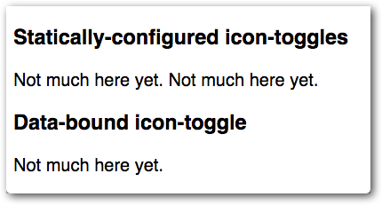



In this codelab, you’ll learn how to build elements using Polymer 1.0. You'll
create a simple Polymer element, a toggle button. The finished button will look
something like this:

You'll be able to use it with simple markup like this:

<pre class="prettyprint">
&lt;icon-toggle>&lt;/icon-toggle>
</pre>

This project introduces you to most of the key concepts in working with
Polymer.

Don't worry if you don't understand everything. Each of the concepts presented
here is described in detail in the Polymer documentation.

## Step 1: Get set up

To follow this tutorial, you'll need:

-   The starting code.
-   Node.js and Polyserve command-line tools to run the demo.

**Note:** If you're not comfortable using the command-line tools, try the alternate
version of this tutorial on the Google Codelabs site, which uses the
Chrome Dev Editor IDE: [Your first element—Google Codelabs](https://codelabs.developers.google.com/codelabs/polymer-first-elements/).
{: .alert .alert-info }

### Download the starting code

1.  Click the button to download the starting code as a ZIP file.

    

      <a href="https://github.com/googlecodelabs/polymer-first-elements/releases/download/v1.0/polymer-first-elements.zip">
        <paper-button raised id="download-button">
          <core-icon icon="file-download"></core-icon>
          Download ZIP
        </paper-button>
      </a>
    

2.  Expand the archive to create your project folder.

    Your project folder should look something like
    this:

    <pre>
    README.md
    bower.json
    bower_components/
    demo/
    icon-toggle-finished/
    icon-toggle.html
    </pre>

    The main file you'll work with is <code>icon-toggle.html</code>, which contains the definition for your custom element.

### Install Node.js and Polyserve

If you're not using CDE, you'll need to install some command-line tools to run the demo.

1.  Download and install Node from [https://nodejs.org/](https://nodejs.org/).
    Node includes the node package manager command, `npm`.

2.  Install `polyserve`:

        npm install -g polyserve

## Run the demo

To run the element demo:

1.  Run `polyserve` from the repo directory:

        polyserve

2.  Open `localhost:8080/components/icon-toggle/demo/` in your browser.
    (Note that the path uses `icon-toggle`—the
    component name listed in this element's `bower.json` file—rather than the actual directory name.)

**Note:**
If you're wondering what `polyserve` does, see [Testing elements with local bower dependencies](../reusableelements.html#local-dependencies).
{: .alert .alert-info }

You'll see some text where the icon toggles should appear. It doesn't look
very interesting, but it shows that everything is working.

<strong>If this text doesn't appear</strong>, make sure you clicked on the the demo folder itself, or on `demo/index.html`.

  <a href="step-2.html">
    <paper-button raised><core-icon icon="arrow-forward"></core-icon>Step 2: Add local DOM</paper-button>
  </a>

