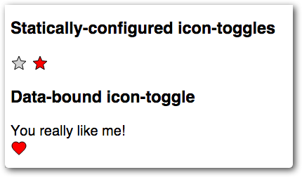

You now have a button that's basically functional. But it's stuck using the
existing text color for both pressed and unpressed states. What if you want to
get a little flashier?

Local DOM helps prevent users from styling your element's internals by
accident. Using custom properties, your element can expose a specific set of
user-styleable properties.

You apply a custom property inside your element using the `var` function.

<pre class="prettyprint">
 background-color: var(<em>--my-custom-property</em>, <em>defaultValue</em>);
</pre>

Where <code>--<em>my-custom-property</em></code> is a custom property name, always starting with two dashes (`--`), and <em>defaultValue</em> is an (optional) CSS value that's used if the custom property isn't set.

Edit your element's `<style>` tag and replace the existing `fill` and `stroke` values with custom properties:

#### icon-toggle.html
{: .caption }

<pre class="prettyprint">
  &lt;style>
    /* local styles go here */
    :host {
      display: inline-block;
    }
    iron-icon {
      fill: var(--icon-toggle-color, rgba(0,0,0,0));
      stroke: var(--icon-toggle-outline-color, currentcolor);
    }
    :host([pressed]) iron-icon {
      fill: var(--icon-toggle-pressed-color, currentcolor);
    }
  &lt;/style>
</pre>

Because of the default values, you can still style the `<icon-toggle>` just by setting `color`, but now you have other options. Open up `demo/icon-toggle-demo.html `and set the new properties:

#### icon-toggle-demo.html
{: .caption }

<pre class="prettyprint">
    &lt;style>
      :host {
        font-family: sans-serif;
        --icon-toggle-color: lightgrey;
        --icon-toggle-outline-color: black;
        --icon-toggle-pressed-color: red;
      };
    &lt;/style>
</pre>

Run the demo again to get colorful.

That's it — you're finished. You've created an element that has a basic UI,
API, and custom styling properties.

If you have any trouble getting the element working, check out the [finished version](https://github.com/googlecodelabs/polymer-first-elements/blob/master/icon-toggle-finished/icon-toggle.html).

  <a href="step-4.html">
    <paper-button raised><core-icon icon="arrow-back"></core-icon>Step 4: React to input</paper-button>
  </a>

