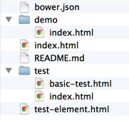



## Introduction

So, you want to publish your first reusable {{site.project_title}} element?
Fantastic! This guide walks you through the process. 

When you're done, you'll have:

-   A local git repo for your element, based on the official boilerplate.
-   A published, Bower-installable version of your element on GitHub.
-   Documentation and a running demo of your element hosted on GitHub pages.

**This guide assumes you have `git`, [Node](http://nodejs.org/) and
[Bower](http://bower.io/) installed on your system, and that you have a  GitHub
account you can use to publish your elements.**

## Install polyserve

Because of the way HTML imports works, you'll need a local web server to test your elements.

Polyserve is a simple web server that lets you use local Bower components. It's great 
for testing elements during development. Install it using `npm`:

    npm install -g polyserve

**Note:** 
You can skip this step and use any local web server to test your elements, but you
will need some extra configuration. See 
[Testing elements with local bower dependencies](#local-dependencies) for details.
{: .alert .alert-info }

## Create

1.  Create a new directory on your system for working on {{site.project_title}}
    elements (e.g `"development"`).

2.  Download the [seed-element](https://github.com/PolymerElements/seed-element/archive/v1.0.0.zip) boilerplate and unzip it in your working directory.

3.  Rename the element and its files accordingly. For example, if your element is
    called `<test-element>` and you've renamed the `seed-element` directory to
    `test-element`, your file list should look a little like this:

4.  Next, run `bower install` inside your element directory to install
    dependencies. The dependencies are installed in the `bower_components` directory. 
    You can now locally develop and serve your element up for testing
    purposes.

## Develop and Test

Add the logic specific to your new element and verify its functionality. 

When importing other components, follow the examples in `<seed-element>` and write 
the paths as if the component folders were siblings to your `test-element` folder.

    <link rel="import" href="../paper-button/paper-button.html">

A good way to quickly sanity 
test your component is to access your demo.html file using polyserve. There are several ways to do this
but one easy method is to run a simple web server that ships with Python, using the following
commands:

    $ polyserve
    Starting Polyserve on port 8080
    Serving components from bower_components
    Files in this directory are available at localhost:8080/components/test-element/...

This starts a web server on port 8080, so you can test your new element by navigating a browser
to the URL `localhost:8080/components/test-element/demo/`.

If you have another process listening on port 8080, you can specify an alternate port # to 
Polyserve using the `-p` argument:

    $ polyserve -p 9999

### Unit tests

A good element should have good unit tests, too. `<seed-element>` comes set up for unit testing
using [`web-component-tester`](https://github.com/Polymer/web-component-tester). You can use the
files in the `test` directory as a starting point for your own unit tests.

### Documentation

The `seed-element` repo comes with built-in documentation using 
[`iron-component-page`](https://github.com/PolymerElements/iron-component-page).
Loading the element's top-level `index.html` shows you the generated docs:

`localhost:8080/components/test-element/`

The documentation tools infer some information from code, and also recognize
some JSDoc-style comments. `seed-element` includes boilerplate for these
comments out of the box. See the [PolymerElements style
guide](http://polymerelements.github.io/style-guide/) for guidelines on
documenting elements.

This allows you to:

* Provide a summary of what your element does.
* Automatically group your documentation by attributes, methods and events.
* Show an example of your element in action.
* Link up to an element [demo](http://polymerlabs.github.io/seed-element/components/seed-element/demo.html).

## Publish

There are two steps to publishing an element on GitHub:

-   Push your work to a GitHub repo and tag it with
    a release number, so people can install it using Bower. 

    In this step you create a *master* branch containing the bare-minimum 
    of code that needs to be consumed by other apps or elements

-   Push a `gh-pages` branch to your repo. This provides live docs and previews of your element via GitHub pages.

    In this step you create a *gh-pages (GitHub pages)* branch containing a landing page for your element. 
    This branch contain **checked-in dependencies**, **demos** and **documentation**.

### Pushing your element to GitHub

Once you're happy with your element, you’ll want to push the code for `test-element` to GitHub and tag a new version of it.

Click [here](https://github.com/new) to create a new repository on GitHub. Try to keep the name of the repository consistent with the naming of your element (e.g if your element is `<test-element>`, your repository should be called `test-element`).

Next, follow the steps below:

    # Inside your development folder, navigate to your element directory
    cd test-element

    # Initialize a new Git repository for test-element
    git init

    # Add the commits for your current code
    git add .
    git commit -m 'My initial version'

    # Add a remote pointing to the GitHub repository you created.
    git remote add origin https://github.com/<username>/test-element.git

    # Push your code to master by running
    git push -u origin master

Next, you’ll want to tag a version of your element on GitHub. You can either do this directly through the GitHub UI **or** via the terminal.

#### Using the terminal

    # Once you feel you have a version of your element you can release, tag it
    # For example, to tag version 0.0.1
    git tag -a v0.0.1 -m '0.0.1'

    # Then, push your tag to GitHub
    git push --tags

#### Using the GitHub UI

Navigate to the main GitHub page for your element and click the "releases" link in the main navigation. It is highlighted in red below:

This will navigate you to the *Releases* page. For a project without any releases, this page will display a message similar to the one below.

Click the ‘Create a new release’ button to proceed.

This will display a Release drafting page where you can enter in version and release information for your element. 
For example, setting v0.0.1 as the tag to create and the `master` branch as target

Once you are happy with the information you have entered into the above form, click the ‘Publish release’ button to complete tagging and publishing a release of your element. 

#### Test install your element

You should now be able to install your component. Change to a new directory for testing and run:

    bower install <username>/test-element

### Publishing a demo and landing page for your element

Now you have a tagged release for your element. Next up, create a
meaningful demo and landing page for your element.

While optional, we recommend modifying the `demo/index.html` page to provide a real-
world [example](http://googlewebcomponents.github.io/google-chart/components
/google-chart/demo.html) of your element. Developers can get a feel for how your
element behaves, and can use your demo as a jumping off point for integrating
your element in their own projects.

This is also your chance to update the [documentation](#documentation) for your
element's public interface. 

To check your docs and demo, start up Polyserve again:

    $ polyserve

Take a look at the rendered docs in `index.html` and the demo in `demo/index.html` 
in your browser to make sure you're happy with your customizations. 

Once the demo and the docs look good locally, **make sure that
you've pushed any changes to your repo's `master` branch.** Also, make sure that
you've updated the name and paths throughout your project, including the ones 
in `bower.json`. You shouldn't have any remaining references to `seed-element`.

You can now use the `gp.sh` script to push a landing page for your element to 
GitHub pages. Inside your terminal, walk through running the following commands.

**Important:** Make sure you run the `gp.sh` script in a temporary directory,
as described below. The script overwrites the contents of the current directory.
{: .alert .alert-error } 

    # Navigate back to your development directory
    cd ..

    # git clone the {{site.project_title}} tools repository
    git clone git://github.com/Polymer/tools.git

    # Create a temporary directory for publishing your element and cd into it
    mkdir temp && cd temp

    # Run the gp.sh script. This will allow you to push a demo-friendly
    # version of your page and its dependencies to a GitHub pages branch
    # of your repository (gh-pages). Below, we pass in a GitHub username
    # and the repo name for our element
    ../tools/bin/gp.sh <username> test-element

    # Finally, clean-up your temporary directory as you no longer require it
    cd ..
    rm -rf temp

This will create a new `gh-pages` branch (or clone and clear the current one) then 
push a shareable version of your element to it. To see your newly-published docs,
point a browser at:

    http://<username>.github.io/test-element/

## Share

You can now share the link to your element hosted on GitHub pages with the
world. As we used the `seed-element` repo, {{site.project_title}} will give you
a styled component page out of the box that looks a little like this:

You can check out the [live](http://polymerlabs.github.io/seed-
element/components/seed-element/) version of this page for the `seed-element`
project.

Now that you’ve published your {{site.project_title}} element to GitHub, you may be interested in 
learning how to [distribute your element using Bower](/0.5/articles/distributing-components-with-bower.html). 

Or read on to find out more about why `<seed-element>` is structured the way it is. 

## Reusable component structure {#structure}

This section contains _background_ information about creating reusable elements.
If you follow the steps above and stick to the patterns used by the `<seed-element>` 
boilerplate, you can publish reusable elements. 

If you're curious about the steps or the project structure, read on.

### HTML imports and dependency management

For HTML imports to de-duplicate your resources correctly, each component you 
use needs to have a single, canonical URL. The {{site.project_title}} components handle this
by assuming that all components are installed in sibling directories:

    bower_components/
      iron-icon/
        iron-icon.html
      paper-icon-button/
        paper-icon-button.html
      paper-ripple/
        paper-ripple.html
      polymer/
        polymer.html

In this structure, `iron-icon.html` can import {{site.project_title}} like this:

    <link rel="import" href="../polymer/polymer.html">

And `paper-icon-button.html` can import _both_ {{site.project_title}} and `<iron-icon>` like this:

    <link rel="import" href="../polymer/polymer.html">
    <link rel="import" href="../iron-icon/iron-icon.html">

If you want to create a re-usable component that depends on {{site.project_title}}, you
need to use the same relative path structure.

### Testing elements with local bower dependencies {#local-dependencies}

Bower installs components in a _flat dependency tree_, which works well on the application level. You get
a directory structure like this:

    my-app/
      bower.json
      bower_components/
        my-element/
          my-element.html
        my-dependency/
          my-dependency.html
      index.html

All components are siblings, so `my-element.html` can import `my-dependency.html` like this:

        <link rel="import" href="../my-dependency/my-dependency.html">

However, when you work on an individual custom element repo that has its own Bower dependencies,
the default Bower install gives you:

    my-element/
      bower.json
      bower_components/
        my-dependency/
          my-dependency.html
      my-element.html

This breaks the relative paths for `my-element` and `my-dependency`. 

The easiest way to fix this is by setting up a local server that remaps the 
paths so that all of the components in `bower_components` appear to be 
in sibling directories to `my-element`. Polyserve does this for you automatically.

