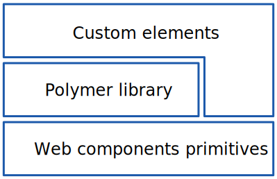

The {{site.project_title}} library is designed to make it easier and faster
for developers to create great, reusable components for the modern web.

## Custom elements extend the web

HTML provides a set of built-in elements like `<button>`, `<form>` and
`<table>`. Each element has its own API of attributes, properties, methods, and
events. Each element has built-in styling, as well as style properties you can
override using CSS.

Anyone can use these elements to build a simple web page. But they're 
limited. To build something as simple as a set of tabs, you need HTML 
plus CSS and usually a script, too.

With custom elements, you can extend the vocabulary of HTML with your own elements. 
Elements that provide sophisticated UI. Elements that are as easy to use as `<select>`: 

    <my-tabstrip>
      <my-tab>
        Home
      </my-tab>
      <my-tab>
        Services
      </my-tab>
      <my-tab>
        Contact Us
      </my-tab>
    <my-tabstrip>

## Is {{site.project_title}} web components? Is it elements?

{{site.project_title}} isn't either of those things. {{site.project_title}} is built on top of the web components standards and it helps you build your own custom elements:

*   **Web components**. These standards provide the primitives you 
    need to build new components. You can build your own custom elements
    using these primitives, but it can be a lot of work.

    Not all browsers support these standards yet, so the [web components polyfill 
    library](http://webcomponents.org/polyfills/) fills the gaps, implementing the APIs in JavaScript.

*   **The {{site.project_title}} library**. Provides a declarative syntax that 
    makes it simpler to define custom elements. And it adds features like 
    templating, two-way data binding and property observation to help 
    you build powerful, reusable elements with less code.

*   **Custom elements**. If you don't want to write your own elements, there 
    are a number of elements _built with_ {{site.project_title}} that you can drop 
    straight into your existing pages. These elements depend on the {{site.project_title}} 
    library, but you can use the elements without using {{site.project_title}} directly.

    You can mix and match elements built with {{site.project_title}} with other
    custom elements, as well as built-in elements.

## Get some elements

The {{site.project_title}} team has written collections of elements that you can use 
in your apps. You can find them on the [Element catalog](https://elements.polymer-project.org/).

## Write your own

Interested in using the {{site.project_title}} library to build your own elements?

Take a quick tour of the features:

<a href="../start/quick-tour.html">
  <paper-button raised><core-icon icon="arrow-forward"></core-icon>Quick tour</paper-button>
</a>

Or jump straight to:

<a href="../devguide/feature-overview.html">
  <paper-button raised><core-icon icon="arrow-forward"></core-icon>Developer guide</paper-button>
</a>

