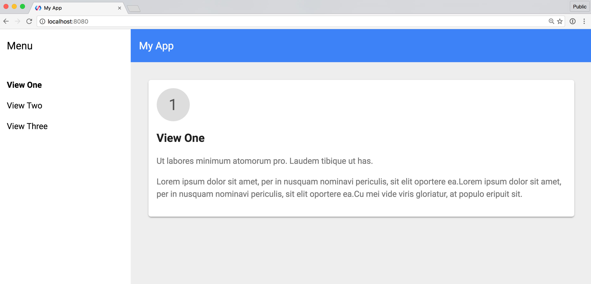

For many developers new to Polymer, the
[Polymer Starter Kit](https://github.com/polymerelements/polymer-starter-kit) 
project is a useful seed to get the ball rolling on their own app. With the 
release of [Polymer CLI](https://www.polymer-project.org/1.0/docs/tools/polymer-cli), 
which contains its own starter projects, it became unclear to developers which 
resource they should choose when creating a new project.

To make it as easy as possible to get started building Polymer projects we’ve 
turned Polymer Starter Kit into a template that you can use with Polymer CLI!



Update your version of Polymer CLI:

```
npm install -g polymer-cli
```

Then run `polymer init` and you should see the `starter-kit` option.


If you’ve previously used Polymer CLI you may notice the old 
`app-drawer-template` is now gone. We’ve replaced it with starter-kit as the two 
are functionally identical. It was always our intention to greatly simplify 
Polymer Starter Kit as its gulpfile and the number of features it was trying to 
support had become unwieldy. Now there should be no question: **if you’re 
starting a new project, use Polymer CLI**.

## The Starter Kit is missing a feature I want, how do I get it added to the project?

What we learned from working on the first iteration of Starter Kit is that it 
doesn’t pay to try to serve two masters. In our case we were trying to both 
support new users who had never touched Polymer, while also trying to include 
all of the build tools someone would need to launch a production app. This often 
lead to a situation where folks who just wanted to play around with Polymer 
would end up stuck, debugging ESLint or wondering what the heck was going on in 
the crazy gulpfile. Essentially, we were getting in new users’ way, and it was 
becoming less of a “starter” kit.

Because Polymer CLI can support 
[installing multiple template projects](https://github.com/Polymer/polymer-cli#templates-and-generators), 
very similar to Yeoman’s generator system, our plan is to keep Starter Kit as 
simple as possible. This means we won’t bother with things like adding ESLint or 
additional build steps like minifying images. Instead we encourage developers to 
build (and share) their own CLI templates that contain all the features they want.

## OK, so how do I add my own build steps?

The Starter Kit relies on Polymer CLI to handle its build process. This means 
you can just run `polymer build` and it will generate a build for you, including 
adding a service worker. If you need to run additional build steps we recommend 
using the 
[Custom Build template](https://github.com/PolymerElements/generator-polymer-init-custom-build) 
instead. This new template project provides an “escape hatch” from the Polymer 
CLI build process by leveraging the 
[`polymer-build`](https://github.com/Polymer/polymer-build) Node module directly 
in its gulpfile. `polymer-build` is the underlying library that powers Polymer 
CLI. By using it directly in Gulp, the Custom Build template is able to add 
additional steps to its build process. These steps can include anything from 
minifying images, to compiling SASS/LESS, or transpiling ES2015 JavaScript.

To get you started the Custom Build template already contains an example for 
minifying images, and the polymer-build docs show additional examples for 
[uglifying JS, compressing CSS, and minifying HTML](https://github.com/Polymer/polymer-build#extracting-inlined-cssjs).

Some have asked “why doesn’t the CLI just transpile my JS for me?” and indeed it 
may someday include that feature. For now we’re starting with the bare minimum 
number of features in the CLI and rolling in new ones as they make sense. So if 
something is missing you can always switch to the 
[Custom Build template](https://github.com/PolymerElements/generator-polymer-init-custom-build) 
to fill in the gaps.

## How do I migrate my current Polymer Starter Kit project?

If you’re already using Polymer Starter Kit v1, and are happy with your current 
app setup, then you likely don’t need to migrate. Starter Kit is really meant to 
be a scaffold to get you up and running and is not intended to be a framework 
that you have to stay in sync with.

Having said that, if you would prefer to use the app-layout elements and PRPL 
pattern features of Polymer Starter Kit v2, then you should be able to port your 
HTML over to the new version. The page layout of Polymer Starter Kit v1 is very 
similar to v2, with the exception that paper-* elements have been replaced by 
app-layout elements. Once you’ve copied everything over, you can take advantage 
of the `polymer build` command to optimize your project.

If you’d also like to maintain control of your gulp build process, then you’ll 
want to port your code over to the Custom Build template. This is the same as 
above, with the additional step of copying over gulp tasks that you care about. 
As mentioned previous, you can refer to the polymer-build README for 
[examples of how to add your own gulp tasks](https://github.com/Polymer/polymer-build/pull/19/files#diff-04c6e90faac2675aa89e2176d2eec7d8R117).

## We’re just getting started

The new Polymer Starter Kit and Custom Build template are really just the first 
steps in a much larger process. Because Polymer CLI is pluggable, both the 
Polymer team and the community should be able to add more templates that focus 
on different areas (like adding SASS or TypeScript) and stick to the principle 
of “doing one thing well” versus trying to cram every feature into a single 
example. We hope you enjoy the new projects and we look forward to seeing what 
you’ll build with them!
