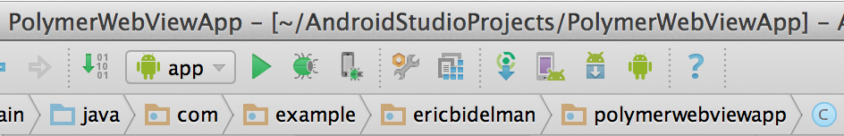
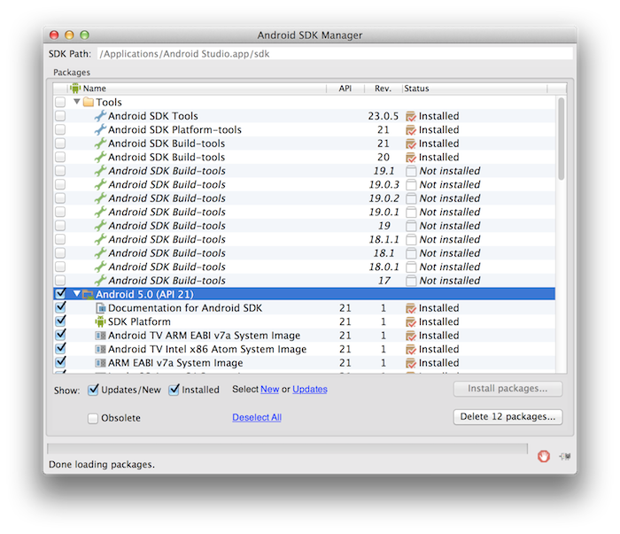





## Introduction

**Important** - this article assumes you are familiar with creating a WebView app on Android. If you're not familiar with WebView development, check out the excellent guides on the Android documentation, [Getting Started: WebView-based Applications for Web Developers](https://developer.chrome.com/multidevice/webview/gettingstarted) and [WebView for Android Overvieww](https://developer.chrome.com/multidevice/webview/overview).
{: .alert .alert-info }

Many developers ask if {{site.project_title}} can be used inside a WebView.
The answer of course is, **yes**. Using {{site.project_title}} in a WebView is no different than creating a normal web app that runs inside a WebView. However, in some cases it's not immediately obvious how to structure an app or get things setup. This guide walks you through starting a new Android WebView project and tweaking it to work with {{site.project_title}}.

[Material design](/docs/elements/material.html) allows developers to create
highly visual apps that look and feel the same across Android and web. If your app
doesn't need access to native device APIs, it's much simpler to create a mobile web app.
{{site.project_title}}'s [paper elements](/docs/elements/paper-elements.html#paper-button) provide the web's implementation of material design and are an excellent, low overhead way achieve its design principles. Just build a web app and wrap it in a WebView.

## Getting started

  <a href="#">
    <paper-button icon="file-download" id="download-button" raisedButton label="Download the WebView Starter Kit"></paper-button>
  </a>

The WebView starter .zip provides an example Android Studio project to get you up and running. It contains a basic mobile web app that uses some of {{site.project_title}}'s [core](/docs/elements/core-elements.html) and [paper elements](/docs/elements/paper-elements.html). You should be able load it directly onto an Android L device/emulator and see it in action. More on minimum Android/SDK versions in the next section.

**Pro Tip:** Before you begin, develop your app as a standalone web app first. Leave the fancy WebView stuff until the end. The Android Emulator can be painfully slow to run and is extremely clunky for debugging web apps. It's much faster to iterate using your normal workflow. Once are the sharp edges are ironed out, dive into WebView-fying it.

## Minimum Android and SDK versions

{{site.project_title}} works under Android 4.4.3+, which ships with the Chromium-based WebView version 33.0.0.0. However, to gain native browser support for all of the web component APIs (HTML Imports, Custom elements, templates, and Shadow DOM), it's important to target **Android L (SDK version 20)**, where **Chrome 36.0.0.0** is the default WebView. Anything pre-Android L will require {{site.project_title}}'s polyfills and you won't see the awesome performance benefits of having native browser support.

To install/update Android SDK, run the SDK manager in Android Studio:

then download the L Preview packages (API 20):

### Supporting older versions of Android {#oldandroid}

{{site.project_title}} does not support the legacy Android Browser, which means the default WebView in older versions of Android (< 4.4.3) will not work.

If you need to support older versions of Android, try [Crosswalk](https://crosswalk-project.org). It's a tool for bringing the new Chromium webview to Android 4.0+. One downside is that the entire Chromium runtime gets bundled with your application. According to the [Crosswalk FAQ](https://crosswalk-project.org/#documentation/about/faq), this means 24Kb web app can be turned into 19.63MB after it's packaged. Something to consider.

## Recommended app structure

The web app which powers your webview app should be entirely in the project's `src/main/assets` folder. Android reserves this directory for raw files that your app needs access to. It's perfect for static web files.

Inside of the `assets` folder, it's generally recommended to create a `www` folder to stash your web app. This folder is also where installed element dependences (e.g. `bower_components`) will go.

### Using Bower to install elements

Create a `bower.json` file in `src/main/assets/www` that lists your app's element dependencies. In this case, we'll just pull in all the paper and core elements:

In `src/main/assets/www`, create **bower.json**:

    {
      "name": "PolymerWebView",
      ...
      "dependencies": {
        "core-elements": "Polymer/core-elements#~{{site.latest_version}}",
        "paper-elements": "Polymer/paper-elements#~{{site.latest_version}}"
      }
    }

### Using HTML Imports

Run `bower install` in the same directory to create and populate the `bower_components` folder. If you're new to Bower, see
[Installing elements](/docs/start/getting-the-code.html#installing-components).

Create `src/main/assets/www/elements.html`, an HTML Import includes all of the imports your app will use:

    <link rel="import" href="bower_components/core-drawer-panel/core-drawer-panel.html">
    <link rel="import" href="bower_components/core-toolbar/core-toolbar.html">
    <link rel="import" href="bower_components/core-icons/core-icons.html">
    ...

### The main page

Create your main page app as `src/main/assets/www/index.html`:

    <!doctype html>
    <html>
    <head>
      <meta name="viewport" content="width=device-width, initial-scale=1">
      <!-- Note: platform.js is only needed in non-Chrome 36 browsers. It's included here for portability. -->
      
      <link rel="import" href="elements.html">
      ...
    </head>
    <body unresolved fullbleed>
      ...
    </body>
    </html>

It's worth noting that platform.js is not needed in Chrome 36. However, if you're
creating an app for multiple platforms, it's still a good idea to include the
polyfills for portability.

Your final folder structure should look something like this:

## Configuring app permissions

Now that you have the Android L Preview installed, you need to tell your app to use that version of the SDK.

In `AndroidManifest.xml`, set the minium and target SDK versions to Android L. If your app also needs access remote URLs, request the `android.permission.INTERNET` permission.

**AndroidManifest.xml**:

<pre>
&lt;?xml version=&quot;1.0&quot; encoding=&quot;utf-8&quot;?&gt;
&lt;manifest ...&gt;

  <b>&lt;uses-sdk
      android:minSdkVersion=&quot;android-L&quot;
      android:targetSdkVersion=&quot;L&quot; /&gt;</b>

  <b>&lt;uses-permission android:name=&quot;android.permission.INTERNET&quot; /&gt;</b>

  &lt;application ...&gt;
      ...
&lt;/manifest&gt;
</pre>

### Tweaking the WebView settings

Out of the box, {{site.project_title}} will not run in a WebView. There are
a few settings that need to be enabled on the WebView for things to work:

- Enable JavaScript!
- Enable access to `file://` so HTML Imports can be loaded off `file://` URLs.
- Ensure local links/redirects act on the WebView (and do not open in the browser).

In **MainActivity.java**, enable the following on your `WebSettings` object:

<pre>
public class MyActivity extends Activity {

  private WebView mWebView;

  @Override
  protected void onCreate(Bundle savedInstanceState) {
    ...
    WebSettings webSettings = mWebView.getSettings();

    // Enable Javascript.</b>
    <b>webSettings.setJavaScriptEnabled(true);</b>

    // Enable HTML Imports to be loaded from file://.
    <b>webSettings.setAllowFileAccessFromFileURLs(true);</b>

    // Ensure local links/redirects in WebView, not the browser.
    mWebView.setWebViewClient(new MyAppWebViewClient());
  }
}
</pre>

If you ever see the following runtime error, it's from HTML Imports not having access to `file://`.

> "Imported resource from origin 'file://' has been blocked from loading by Cross-Origin Resource Sharing policy: No 'Access-Control-Allow-Origin' header is present on the requested resource. Origin 'null' is therefore not allowed access.", source: file:///android_asset/www/index.html

Be sure you're calling `setAllowFileAccessFromFileURLs(true)` when setting up the Activity.

## Loading the main page

Congrats! Your app is built and chillaxing in `src/main/assets/www`. The last step is to load your index.html from the filesystem.

**MainActivity.java**:

<pre>
public class MyActivity extends Activity {

  private WebView mWebView;

  @Override
  protected void onCreate(Bundle savedInstanceState) {
    ...

    // Load main page into webview.
    <b>mWebView.loadUrl("file:///android_asset/www/index.html");</b>

    ...
  }
}
</pre>

You'll also want to override `shouldOverrideUrlLoading()` so non-local links open in the browser and not the WebView. In **MyAppWebViewClient.java**:

    public class MyAppWebViewClient extends WebViewClient {
      @Override
      public boolean shouldOverrideUrlLoading(WebView view, String url) {
        if (Uri.parse(url).getHost().length() == 0) {
            return false;
        }

        Intent intent = new Intent(Intent.ACTION_VIEW, Uri.parse(url));
        view.getContext().startActivity(intent);
        return true;
      }
    }

## Tips &amp; tricks

1. Include the `fullbleed` and `unresolved` attributes on `<body>`:

        <body unresolved fullbleed>

  The [`fullbleed`](/docs/polymer/layout-attrs.html) attribute removes `<body>` margins and maximizes its height to the viewport. The [`unresolved` attribute](/docs/polymer/styling.html#fouc-prevention) minimized FOUC.

2. Use [Vulcanize](/articles/concatenating-web-components.html) to crush your HTML Imports into a single import. Doing reduce load time. It's recommended to run Vulcanize with the `--csp --inline --strip` flags.

3. You only need to load the platform.js polyfills if your WebView version is before Chrome 36.

        <!-- Only needed if your WebView version is before Chrome 36.-->
        

## Resources

- [Getting Started: WebView-based Applications for Web Developers](https://developer.chrome.com/multidevice/webview/gettingstarted)
- [WebView for Android Overvieww](https://developer.chrome.com/multidevice/webview/overview)
- [Building Web Apps in WebView](http://developer.android.com/guide/webapps/webview.html)


