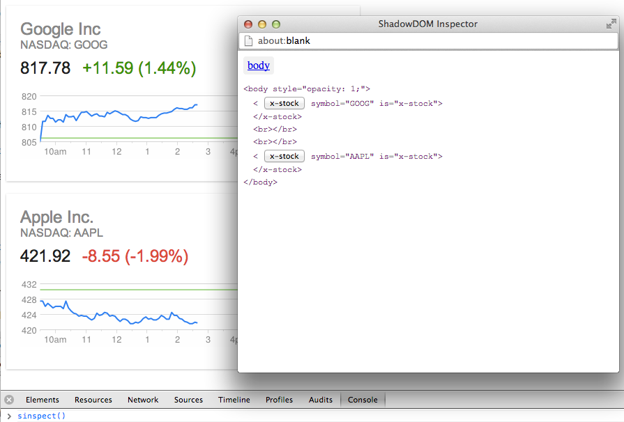

This document lists changes to the entirety of the project, including polyfill repos.

## 2013-04-11

  <b>Notice</b>: This release contains important changes to the structure of the project.

* The `toolkit` repository now brings in the `platform` repository as a submodule.
* Until now, the _dev_ branch has been the development branch and _master_ has
been the stable release. Now, the _stable_ branch is the default "stable" codebase.
_master_ branches are the in-development tip of tree. The _stable_ branch is also
the default view on Github.

### Toolkit

* `g-component.html` no longer exists as the Tookit kernel. It has been replaced
with loading in `toolkit.js` instead.
* Added `debug` [runtime flags](/runtime-config.html) to conditionally load debug
version of `platform.js`.

## 2013-02-25

### Toolkit

* Changed "toolkit/src" folder name to "toolkit/components". Update your source paths accordingly.

* Introduced `selectedClass` property to g-selector component. ([commit](https://github.com/toolkitchen/toolkit/commit/a1565b536ea05cddf7a5984c15017c2bc803d1e5))

* g-selector now sends an `activate` event which is fired whenever an item is activated (can occur when the currently selected item is activated). The `select` event is fired only when the selected item changes. ([commit](https://github.com/toolkitchen/toolkit/commit/5aaddd82d89796b493726d31fb5ab2d73a7e1770))

* g-menu-button: the menu now closes in response to the selector's activate event ([commit](https://github.com/toolkitchen/toolkit/commit/5aaddd82d89796b493726d31fb5ab2d73a7e1770))

* g-selection: selecting the same item is now a no-op ([commit](https://github.com/toolkitchen/toolkit/commit/0075c4c4c39afa1235e8afd3580099f6c530a5ff))

* Added support for 2-way bindings on input elements ([commit](https://github.com/toolkitchen/toolkit/commit/16715bbb25fbb8a97455e66cd17021b7761ae0ad))

* g-ajax: Response is bindable; params can be set as json or object.

* g-panels: Added `autoselect` property that controls if keys/swipes can select panels; added `canselect` event to control if a panel can be selected.

### Platform

* Landed version 2 of the Shadow DOM shim. See the [pull request](https://github.com/toolkitchen/polyfills/pull/88) for details.

* ShadowRoot now installs shadow reference on `node.webkitShadowRoot`, as per spec. Fixes [#68](https://github.com/toolkitchen/toolkit/issues/68). ([commit](https://github.com/toolkitchen/toolkit/commit/34363b6093674956118d8d82cea389961d0e5337))

* Loader: allow stylesheets and scripts in components defined in document. ([commit](https://github.com/toolkitchen/toolkit/commit/9875a08fb3f0b153ea044d19b8b3b39cf6e3656c))

### Tools

* Shadow DOM inspector
Added a tool for inspecting Shadow DOM trees. You can invoke the tool via <code>window.sinspect(<em>node</em>)</code>, where `node` is the element to start inspecting from. If not specified then it will use `document.body`.

To use the tool, open the JavaScript console and type `sinspect()`.

**Note**: The tool opens in a pop-up window so you may have to unblock it.

