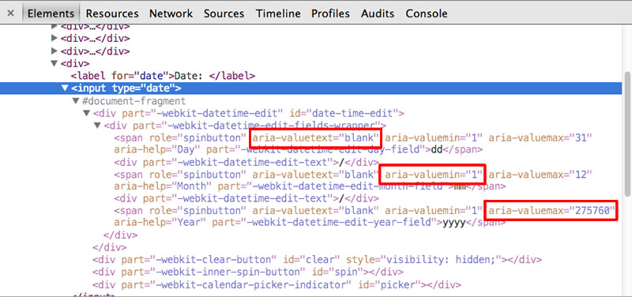



*Don't see an answer to your question on here? Ask on the [mailing list](/discuss.html)!*



## {{site.project_title}} 

### Why should I care about this project? {#why}

{{site.project_title}} is a new type of library for the web, targeting the modern
web platform, and useful for building web applications based on Web Components.

Unlike some other frameworks before it, {{site.project_title}} attempts to embrace
HTML as much as possible by encouraging the use of [custom element](/platform/custom-elements.html) wherever possible. It includes a handful of independent polyfills for these emerging web standards (Custom Elements, Shadow DOM, etc.) that over time, diminish and ultimately disappear as browser vendors implement the native APIs.

{{site.project_title}} is still in its very early days, but we're excited about its potential! 

### Where are all of the shiny magic components that are going to revolutionize the entire internet and solve all of my problems? {#uicomponents}

At this point they're basically just a glimmer in our collective eye. But we've built a solid technical foundation and are working feverishly to make our ambitious vision a reality, so watch this space.

### Okay, the components aren't there yet. Is the rest of {{site.project_title}} production ready? {#readiness}

We don't think so, but if you're the adventurous type you're welcome to give it a try. Run the demos, play with the toolkit. Most importantly, join the mailing list and give us feedback!

### I don't like your {components | toolkit syntax | face }! {#dislike}

<!-- 
<figure id="architecture-diagram" style="float:right">
  <iframe src="/images/architecture-diagram.svg?{{'now' | date: "%Y%m%d"}}" style="width:150px;"></iframe>
  <figcaption>Architectural Diagram</figcaption>
</figure> -->

That's fine. We've designed {{site.project_title}}  to be cleanly layered so you can use just the parts you like. You can use our whole stack, a single polyfill, or anything in between. It's up to you.
<!-- {: style="clear:both"} -->

### What is Sandbox? Is this an IDE? {#sandbox}
[Sandbox](http://polymer-project.org/tools/sandbox/) is just an easy way to explore Polymer without having to check out code. It's not intended to be an IDE, and definitely not required to create applications. The tool is simply a convenience that helps write code faster. See for yourself by dragging an element onto the canvas, then flip over to the code view to understand the one-to-one correspondence between the UI and simplistic Polymer code.

### Which browsers does {{site.project_title}} support? {#browsersupport}

{{site.project_title}} aims to support [evergreen browsers](http://www.yetihq.com/blog/evergreen-web-browser/). After all, we're trying to simulate the future, and as someone once said, "You're headed for trouble if all you do is stare in the rear-view mirror." In practice, this means we support the most recent versions of Chrome, Safari, Internet Explorer, and Firefox. Note that this is fewer browsers than other frameworks support. For example, {{site.project_title}} only aims to support Internet Explorer 10 and above. Some pieces of {{site.project_title}} may support more browsers if it doesn't require too much extra effort--if you find bugs in unsupported browsers, please still file them.  Most things should work in IE9 today without too much work; feel free to file bugs on what doesn't.  IE8 is incompatable due to its insufficient DOM support. 

See our [Browser Compatibility](/compatibility.html) page for more information.

### When will other browsers support these APIs natively? {#nativesupport}

The foundation layer in our <a href="/images/architecture-diagram.svg" target="_blank">architecture diagram</a> is based on emerging web standards. As browsers support them natively, the need for that layer will diminish and ultimately disappear. It's impossible to say when every browser will support these features natively--but the more that web developers ask for them, the sooner native support will come.

### What's your mobile story? {#onmobile}

One of our core goals is for {{site.project_title}} to work on mobile as a first-class citizen. For example, many parts of {{site.project_title}} work on Chrome for Android and Mobile Safari today. We're also investigating responsive components that can automatically configure themselves correctly on desktop, tablets, and phones.

### What does this have to do with x-tags? {#xtags}

[x-tags](http://x-tags.org/) is a cool project that Mozilla is working on, and it's not directly affiliated with {{site.project_title}}. However, both {{site.project_title}} and x-tags build on the emerging Custom Elements standard, which means their components are interoperable by default. Both Google and Mozilla offer polyfills for the Custom Element spec. X-Tag works on top of either, so you can use X-Tag custom elements alongside your {{site.project_title}} components. We're working actively with them to maximize compatibility between the component sets.

### How is {{site.project_title}} different from Twitter's Bootstrap or Adobe's Topcoat? {#uiframeworks}

Bootstrap and Topcoat are awesome CSS/UI libraries. Our goals for {{site.project_title}} are different. While we eventually plan to create a standard set of shiny amazing UI components, the meat of {{site.project_title}} is geared towards developers interested in building web applications on top of Web Component technologies. {{site.project_title}} also provides additional sugaring APIs to meet the demands of today's web applications.

### Wait, what happened to Toolkitchen? {#toolkitchen}

Toolkitchen was the first name we picked for this project. We didn't love it, so
we changed it to {{site.project_title}}.

### How is this related to Google? {#google}

We're first and foremost just a group of folks who think web components are the bee's knees--a bunch of us just happen to work at Google. We're thrilled about the community participation we've gotten already and hope you'll join in the discussion!

### Is this project related to {Angular JS | Closure | Google Web Toolkit}? {#frameworks}

Nope.

### How is {{site.project_title}}.dart related to {{site.project_title}}? {#dart}

polymer.dart is a Dart port of {{site.project_title}} created and maintained by the Dart team. The Dart team is collaborating with the {{site.project_title}} team to ensure that polymer.dart elements and polyfills are fully compatible with {{site.project_title}}. 

### I see a bunch of XHRs making network requests. What gives? {#xhrrequests}

One limitation of today's polyfills is that {{site.project_title}} aggressively uses XHR to shim HTML Imports. We're experimenting with packaging systems and build steps to reduce the cost of network requests. When this API lands natively in browsers, things will Just Work™. Resources will be loaded as they normally do, taking advantage of parallelism, browser caching, etc.

You can try [Vulcanize](/articles/concatenating-web-components.html), which
is a build tool for concatenating a list of elements and inlining their definitions into your main page.

### Performance. Do you care about it? {#performancestuff}

Deeply. And we want the entire web platform to be a buttery smooth 60fps. That said, we have not yet run benchmarks on the various polyfills--we're in the early stages, after all! If you're interested in helping us put some numbers behind these guys, [let us know](/discuss.html).

Remember our libraries go away over time! {{site.project_title}} gets better, stronger, and faster as native browser implementations pop up.

### The filesize of polymer.min.js is big (~163KB). Why? {#filesize}

Minified and gzipped, polymer.min.js is ~48KB (for comparison JQuery 1.10 is 32KB). Keep
in mind that most of this size comes from the polyfills; code which has a death wish
and goes away over time as browsers support the native APIs.

{{site.project_title}} has also been designed to be a la carte. For example, if
you're only interested in Custom Elements, use the custom elements polyfill. If you
only want Shadow DOM, use its polyfill. polymer.min.js is simply a convenient bundle
for developers that includes all of the the pieces for building
{{site.project_title}}-based applications.

### Does {{site.project_title}} work under Content Security Policy (CSP)? {#csp}

Yes. By using `polymer.min.js` and [creating elements that use external scripts](/docs/polymer/polymer.html#alternate-ways-to-register-an-element), {{site.project_title}} runs under [CSP](http://www.html5rocks.com/tutorials/security/content-security-policy/). If you prefer to keep your element's
script inline to `<polymer-element>`, we recommend using [Vulcanizer](/tooling-strategy.html#vulcanizer)
and running with the `--csp` flag.

In other nuanced cases, {{site.project_title}} fails under CSP. This is because
the [HTML Imports](/platform/html-imports.html) is polyfilled using XHR, which can
in turn, execute strings as JavaScript and fail CSP. This problem will go away with
native HTML Imports (see Blink's [crbug.com/240592](http://crbug.com/240592) tracking bug).

### How can I contribute? {#contributing}

We love to hear your comments or suggestions. [File a bug](https://github.com/polymer/polymer/issues/new) or swing by the [mailing list](/discuss.html) and say "hi"--we don't bite! If you want
to contribute code, see our [contributor's guide](https://github.com/polymer/polymer/blob/master/CONTRIBUTING.md).

### Where is the best place to file bugs? {#filebugs}

We have many different demo, platform, and library repositories. If you know exactly where the problem lives in the stack, please file the bug under the appropriate repo. Otherwise, filing under the general [{{site.project_title}}](https://github.com/polymer/polymer/issues/new) project is great.

### How do I manage JavaScript dependencies to prevent 1000 copies of library X? {#loadlibs}

There is no way to guarantee sharing and deduping in the general case. However, if
you have a library of components that use a library, they can all import a
"library.html" file that loads that library. [HTML Imports](/platform/html-imports.html)
will de-dupe the import based on it's fully qualified path.

If multiple libraries want to share a dependency, they will have to agree on a system.
Feature detection, or an agreed upon common location for a 'jquery.html' file in a CDN, etc.

### What sort of testing do you do?

{{site.project_title}} uses Chromium's continuous build infrastructure to test
the entire system and each polyfill, individually. See our [build status page](/build/).

### How can I validate property values? {#validateinput}

One way to validate input is to use a `*Changed` handler on to observer the
property changing, but separate out the "set value" vs. the "validated value":

    <polymer-element name="x-foo" attributes="color">
      <template>
        Do you like the color {{validColor}}?
      </template>
      
    </polymer-element>

    <x-foo color="orange"></x-foo>

### Can an element `extend` from more than one element or have multiple inheritance? {#multipleextends}

For example `<polymer-element name="my-element" extends="foo bar">`. 

No. But {{site.project_title}} may provide a syntax for mixins in the future.

### I don't like package managers, can't I download {{site.project_title}} as a zip? {#bower}

{{site.project_title}} has many different pieces. Creating a one-stop-shop .zip for
all of the different permutations is unwieldy. If you really want a .zip, Github
provides a download link on each project page. However in some cases, you won't get the necessary
dependencies and will need to do this on multiple repositories.

Web components and {{site.project_title}} are intended to be extremely granular.
This is on purpose, to allow users to use exactly what they need and nothing more. In additional to granularity, higher-level components may be composed out of lower-level components. Bower allows us to
easily manage those dependencies.

## Data-binding

### How do I use data-binding to repeat an `<option>` or `<tr>`? {#option-tr}

Until the addition of HTML `<template>`, certain elements like `<select>`, `<table>`, and [others](https://github.com/Polymer/TemplateBinding/blob/master/src/TemplateBinding.js#L117) had special parser rules to prevent anything other than `<option>` and `<tr>` from being their children, respectively. Because of these legacy rules, browsers that don't support `<template>` will lift unexpected elements out of context and make them siblings, including `<template>` itself!

For example, the following won't work correctly in browsers that don't support `<template>`:

    <!-- Won't work in browsers that don't support <template>. -->
    <table>
      <template repeat="{{tr in rows}}">
        <tr><td>...</td></tr>
      </template>
    </table>

The `<template repeat>` is hoisted out and rendered as a sibling:

    <!-- Unsupported browsers make the child <template> a sibling. -->
    <template repeat="{{tr in rows}}">
      <tr><td>...</td></tr>
    </template>
    <table>
      ...
    </table>

For **browsers that don't support `<template>`**, the [TemplateBinding](/platform/template.html) [prollyfill](http://prollyfill.org/) has the ability to repeat `<option>` and `<tr>` directly using the `template` attribute:

    <table>
      <tr template repeat="{{tr in rows}}">
        <td>Hello</td>
      </tr>
    </table>

Another example using`<select>`/`<option>`:

    <polymer-element name="my-select">
      <template>
        <select>
          <option template repeat="{{options}}">{{}}</option>
        </select>
      </template>
      
    </polymer-element>
    

If your users are using browsers that don't support `<template>`, use the `template`
attribute on these [special elements](https://github.com/Polymer/TemplateBinding/blob/master/src/TemplateBinding.js#L117).

**Note:** browsers with native support for `<template>` allow it to be a child
of elements `<select>` and `<table>`. If you know your users are using a browser
with support, write your repeaters like this:

    <table>
      <template repeat="{{tr in rows}}">
        <tr>
          <td>Hello</td>
        </tr>
      </template>
    </table>

### How can I access the current named model instance that in a `<template repeat>`? {#templateinstancemodel}

For example, in a `on-*` handler, you can access the named model instance using: `e.target.templateInstance.model.<property>`:


    <polymer-element name="x-foo">
      <template>
        <template repeat="{{user in users}}">
          
{{user.name}}

        </template>
      </template>
      
    </polymer-element>


### My components are producing markup with multiple ids of the same name. {#multipleids}

{{site.project_title}} tries hard to mimic native Shadow DOM, in that nodes with the same
`id`s will still be encapsulated.

However, you should avoid using DOM-level id referencing (e.g. `<label for>`) when using {{site.project_title}}. The `id` may not resolve correctly when under the Shadow DOM polyfill.

### How quickly are data changes propagated? {#dirtychecking}

If `Object.observe()` is available, data changes happen ~immediately at end of a microtask.
When `Object.observe()` is not supported, {{site.project_title}} uses its polyfill ([observe-js](https://github.com/Polymer/observe-js)) to poll and propagate data-changes throughout the system every 125ms.

Instead of waiting for the next poll interval, one can manually schedule an update
by calling `Platform.flush()`. **There are very few cases where you need to call `Platform.flush()` directly.**

Note: on platforms that support `Object.observe()` natively, `Platform.flush()` does nothing.

### Is {{site.project_title}} available on a CDN? {#cdn}

Yes! We're up on [cdnjs](http://cdnjs.com/). See [Getting the code](/getting-the-code.html#cdn).

## Web Components

### How do I package a bunch of custom elements together? {#packaging}

Use a custom build step that flattens/concatenates everything into a single file,
then use [HTML Imports](/platform/html-imports.html) (`<link rel="import">`) to 
bring that file into your app. 

Similarly, you could write a build step that inlines any custom element definition
directly into your main app. We've experimented with this basic idea in a
tool we call [Vulcanizer](/tooling-strategy.html#vulcanizer).

### Crawlers understand custom elements? How does SEO work? {#seo}

They don't. However, search engines have been dealing with heavy AJAX
based application for some time now. Moving away from JS and being more declarative
is a good thing and will generally make things better.

### Is there a registry of components I can play with? {#registry}

Not yet, but we think that's a great idea.

### I get errors when trying to use external stylesheets in my element definition or using `<link rel="import">` with external files. {#externalsheets}

Unfortunately, this is a limitation of the HTML Import spec and the polyfill follows suit. The polyfill uses XHR to pull down resources defined in an `<polymer-element>` definition. External resources will fail if they are not [CORs-enabled](http://www.html5rocks.com/tutorials/cors/).

For stylesheets that are not same domain or CORs-enabled, you can use `@import` in a `
        ...
      </template>
    </polymer-element>

*Note*: If your stylesheet **is** CORs-enabled or from the same domain as your app,
it's preferred to inline the styles without using `@import`. For example:

    <polymer-element ...>
      <template>
        <link rel="stylesheet" href="frameworkstyles.css">
        ...
      </template>
      ...
    </polymer-element>


### How can I use web fonts or CSS Animations in my custom element? {#fontsanimations}

See "[Making styles global](/docs/polymer/styling.html#making-styles-global)".


### Why does my element claim its `.clientWidth/clientHeight` is 0? {#clientDimenstions}

By default, customs elements are `display: inline`. The fix is to give your element
a default style of `display: block` using `:host`.

    <polymer-element name="my-element">
      <template>
        
        ...
      </template>
      ...
    </polymer-element>
    

### How do I access the DOM in a `<content>`? {#accessContentDOM}

For a `<content>`, you can iterate through `content.getDistributedNodes()`
to get the list of nodes distributed at the insertion point.

In {{site.project_title}}, the best place to call this method is in the [`attached()` callback](http://www.polymer-project.org/polymer.html#lifecyclemethods) so you're guaranteed that the element is in the DOM tree.

Also remember that you can access the light DOM as the element's normal children
(i.e. `this.children`, or other accessors). The difference with this approach
is that it's the entire set of *potentially* distributed nodes; not those actually distributed.

### Why do elements report zero (light DOM) children at created/ready time? {#zerochildren}

It's generally a mistake to attempt to reference an element's children (light dom) in either the `createdCallback` or {{site.project_title}}'s `ready()` method. When these methods are fired, the element is not guaranteed to be in the DOM or have children. In addition, {{site.project_title}} calls `TemplateBinding.createInstance()` on an element's `<template>` to create its Shadow DOM. This process creates and binds elements in the template one by one.

The best time to take a first look at an element's children is in the `enteredView` callback. This is when the element is in the DOM, has a parent, and possibly children. If you need to see changes to light DOM children after that, setup a Mutation Observer to do so.

### Can I use the `constructor` attribute without polluting the global namespace? {#constructorattr}

By design, `constructor` puts the constructor's name on `window`. If you don't want
this, there are two options:

1. Don't use the `constructor` attribute. Use `document.createElement()` instead.
2. Use `document.register()` and wrap the constructor it returns in a namespace.

### Does Shadow DOM play nicely with assistive technologies and screen readers? {#accessibility}

**Note:** Steve Faulkner had a [nice writeup](http://blog.paciellogroup.com/2012/07/notes-on-web-components-aria/) on this topic a while back and found that it does.

A common mis-conception is that the Shadow DOM doesn't play nicely with assistive technologies. The reality is that the Shadow DOM can in fact be traversed and any node with Shadow DOM has a `shadowRoot` property which points to it's shadow document. Most assistive technologies hook directly into the browsers rendering tree, so they just see the fully composed tree.  

In fact, if you inspect one of the native HTML elements that use Shadow DOM, `<input type="date">` for example, you'll notice aria attributes inside the tree:

Other types of assistive tools like [Chromevox](http://www.chromevox.com/) will [need to be updated](https://code.google.com/p/chromium/issues/detail?id=96373) to learn how to traverse the Shadow DOM. 
There's an ongoing discussion with accessibility experts on how best to integrate Shadow DOM with screen readers and search engines and further progress in this area is likely to come in the future.

### How do I access the `activeElement` inside a {{site.project_title}} element? {#activeelement}

Shadow Roots have their own `activeElement`, which you can access internally as 
`shadowRoot.activeElement`.

### Why don't my element's properties/methods autocomplete in the DevTools? {#autocomplete}

This is an artifact of the Shadow DOM polyfill. It creates wrappers around DOM elements
and exposes only the standard DOM APIs (e.g. `querySelector`) on those wrappers. {{site.project_title}} sets up properties on these wrapper objects, not on the actual DOM object. Since the DevTools
only knows about the actual DOM, your element properties won't be seen by the tools.

**Tip:** select a node in the inspector can type `wrap($0)` into the console. You'll
get the wrapped node with all the {{site.project_title}} goodies attached. You can also
use `unwrap()` if you need to go the other direction.
{: .alert .alert-info }

Under native Shadow DOM this isn't an issue. Properties will auto complete in the console.

---

*Special thanks go to GitHub user md_5 who generously donated the {{site.project_title}} organization name.*

